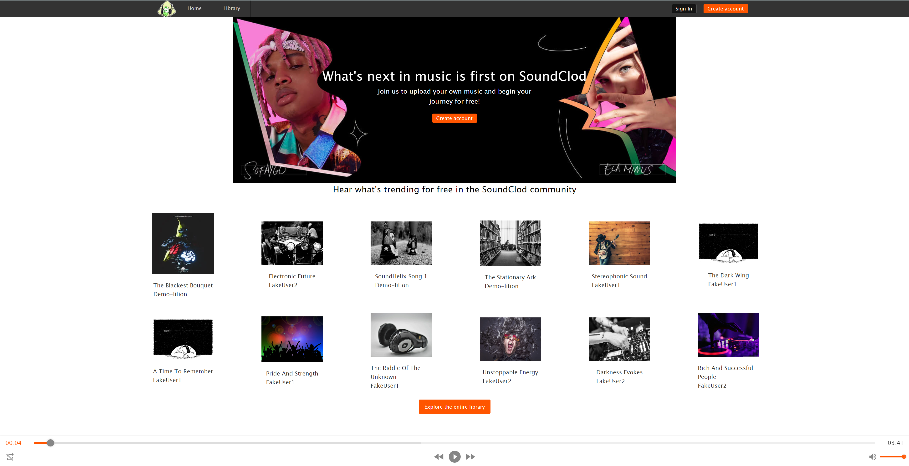
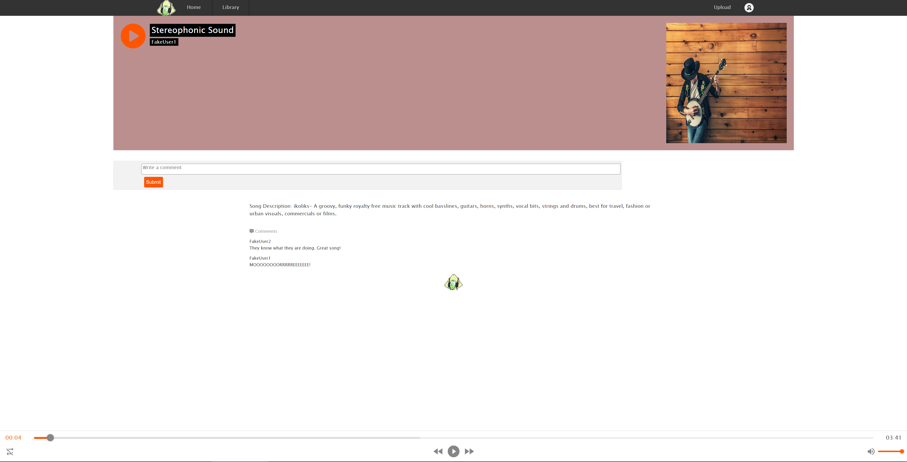

## Welcome to SoundClod, a clone of SoundCloud.
Link to live site here

This is a simple clone of SoundCloud including an audio player, song pages, and a generic library. More will be added in the future.

## This project was built with:
- Javascript
- React with Redux
- CSS
- HTML5
- Sequelize

## This project is hosted on Heroku with a Postgres Database.

## SoundClod Examples

## RoadMap for the future of SoundClod:
- Better funtionality of the audio player and pause button on songs.
- Artists pages.
- Albums pages and functionality on songs.

## Getting started
- Download the project and run npm install.
- In your terminal, cd into 'backend' and run npm start to begin the backend server.
- In your terminal, cd into 'frontend' and run npm start to begin the frontend server.

## Contact Information
http://github.com/Sparky338

matthewjhutter@gmail.com
