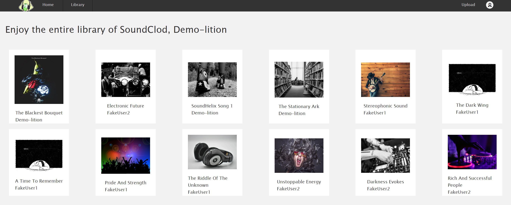

## Welcome to [SoundClod](https://sound-clod.onrender.com/), a clone of SoundCloud.

This is a simple clone of SoundCloud including an audio player, song pages, somments, and a generic library. More will be added in the future.

## This project was built with:

## This project is hosted on Render with a Postgres Database.

## SoundClod Examples
Splash Page

Song Page

Library after log in

## RoadMap for the future of SoundClod:
- Better funtionality of the audio player and pause button on songs.
- Artists pages.
- Albums pages and functionality on songs.

## Getting started
- Download the project and run npm install.
- In your terminal, cd into 'backend' and run npm start to begin the backend server.
- In your terminal, cd into 'frontend' and run npm start to begin the frontend server.

## Contact Information
http://github.com/Sparky338

matthewjhutter@gmail.com
